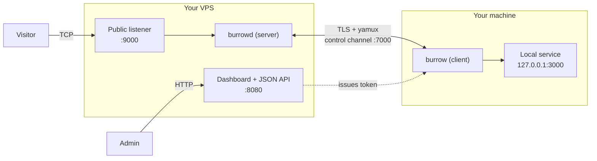

# Burrow

> Self-hosted reverse tunnels — expose a local port through a relay you run yourself. One server binary, one client binary, one public URL. Apache-2.0, no held-back features.

## Status

**v0.1 — MVP, working end to end.** Burrow tunnels TCP today: a TLS-authenticated control plane, a TCP data plane, database-backed token auth, an HTTP/JSON API, and a web dashboard embedded in the server binary. You can self-host the relay on a VPS and expose a local service in a couple of minutes.

This is **early software**: single-admin, TCP only, expect rough edges and breaking changes before v1.0. It works and it is honest about what it is — it is not yet battle-tested in production.

## Why Burrow

- **Self-hosted, no SaaS.** The relay runs on your server. No third party sees your traffic, no account, no limits you didn't set.
- **Apache-2.0, no open core.** Every feature is in this repository. Nothing is held back for a paid tier.
- **Two static binaries.** `burrowd` (server) and `burrow` (client). No runtime, no `docker compose` of seven services. Pure Go, cross-compiled to six platforms with no CGO.
- **Batteries included.** A real embedded web dashboard, token auth, a JSON API, and live per-tunnel byte counters — not just a port forwarder.

## Quickstart

You need a host with a public IP (the relay) and the machine running the service you want to expose.

**1. Run the relay** on your VPS. This generates self-signed dev TLS certs into `./certs`, seeds the admin user, serves the dashboard + API on `:8080`, and the control channel on `:7000`:

```bash
BURROW_ADMIN_EMAIL=you@example.com BURROW_ADMIN_PASSWORD=pick-a-strong-password \
  burrowd serve --dev-certs
```

**2. Create a tunnel token.** Open `http://<your-vps>:8080`, log in with the admin credentials from step 1, and create a token — copy the `bur_…` value. *(No browser handy? On the VPS run `burrowd token --email you@example.com` and copy the printed token.)*

**3. Expose your local service** from your machine. This publishes `127.0.0.1:3000` on the relay's port `9000`:

```bash
burrow connect --server <your-vps>:7000 --token bur_xxx \
  --local 127.0.0.1:3000 --remote 9000 \
  --cacert dev-ca.pem --server-name <your-vps>
```

`--cacert` is the relay's `certs/dev-ca.pem` — copy it from the VPS to your machine first (or, for a throwaway local test only, drop `--cacert`/`--server-name` and pass `--insecure`; never in production). Omit `--remote` to let the server pick a free port (9000–9100 by default). Visitors now reach your service at `<your-vps>:9000`.

For production, terminate TLS with real certificates — set `BURROW_TLS_CERT` / `BURROW_TLS_KEY` (or `--tls-cert` / `--tls-key`) instead of `--dev-certs`, and put the dashboard behind HTTPS.

### Install

Prebuilt binaries for Linux (amd64 / arm64 / armv7), macOS (amd64 / arm64), and Windows (amd64), plus a multi-arch container image, are published on the [Releases](https://github.com/ankoehn/burrow/releases) page for each tagged version.

Docker:

```bash
docker run -d --name burrow \
  -p 8080:8080 -p 7000:7000 -p 9000-9100:9000-9100 \
  -e BURROW_ADMIN_EMAIL=you@example.com \
  -e BURROW_ADMIN_PASSWORD=pick-a-strong-password \
  -e BURROW_DATABASE_PATH=/data/burrow.db \
  -v "$PWD/data:/data" -w /data \
  ghcr.io/ankoehn/burrow:latest serve --dev-certs
```

Or use the provided [`docker-compose.yml`](docker-compose.yml).

Build from source (Go 1.25+):

```bash
git clone https://github.com/ankoehn/burrow && cd burrow
make build            # or: task build   (Windows / no make)
./bin/burrowd version
./bin/burrow version
```

## Comparison

|  | **Burrow** | frp | ngrok | Pangolin |
|---|---|---|---|---|
| Self-hosted relay | ✅ | ✅ | ❌ (hosted SaaS) | ✅ |
| License | Apache-2.0 | Apache-2.0 | Proprietary | AGPL-3.0 |
| Held-back / paid-only features | None | None | Many | Some |
| Deploys as | 2 static binaries | 2 static binaries | client binary + SaaS | container stack |
| Built-in web dashboard | ✅ | ✅ | ✅ (hosted) | ✅ |
| Scope (Burrow v0.1) | TCP | TCP / HTTP / UDP | TCP / HTTP / TLS | HTTP / TCP + access control |

Burrow is the youngest and narrowest of these — it does one thing (self-hosted TCP tunnels with a clean dashboard) under a permissive license with no held-back features. frp is the closest mature analogue; choose Burrow if you want a smaller surface and the Apache-2.0 "nothing held back" guarantee.

## Architecture



The client opens a single outbound TLS connection to the server and authenticates with a token. Control messages are multiplexed over a yamux session; each visitor connection becomes a new stream that the server bridges to the client, which dials your local service. The dashboard and JSON API run inside the same `burrowd` process and mint the token the client uses.

## Roadmap

v0.1 (this release) is the MVP: TLS control plane, TCP data plane, token auth, HTTP/JSON API, embedded dashboard, single admin. Likely directions beyond v0.1 (ideas, not commitments): HTTP-aware tunnels with hostname routing and automatic TLS, multi-user accounts, the `*_FILE` Docker-secret convention, login rate limiting, and dashboard polish. Tracked deferrals live in [`BACKLOG.md`](BACKLOG.md). Issues and discussion are welcome.

## Contributing & security

See [`CONTRIBUTING.md`](CONTRIBUTING.md), [`CODE_OF_CONDUCT.md`](CODE_OF_CONDUCT.md), and [`SECURITY.md`](SECURITY.md).

## License

[Apache License 2.0](LICENSE). No open core, no held-back features.

<!-- demo GIF: recorded and embedded by the maintainer at launch (Phase 5 handoff) -->
