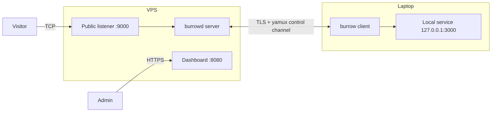

# Burrow

> Self-hosted, open-source reverse tunnels — ngrok's experience on a server you control, Apache 2.0, no held-back features.

Burrow exposes a local port to the public internet through a relay you run yourself: one `burrowd` process on a VPS, one `burrow` process on your laptop, one public URL. Each side is a single Go binary with an embedded dashboard — no `docker-compose` of seven services, no vendor lock-in. This repository is currently the project skeleton; see the roadmap for where it is going.

> ⚠️ **Pre-alpha. Do not use in production.** Nothing tunnels yet — this is the Phase 1 scaffolding from the MVP plan. The control protocol, data plane, API, and dashboard land in later phases.

## Architecture (target MVP)



## Status

Phase 1 (repo & scaffolding): builds two do-nothing binaries with CI, lint, and release config.

## Build

Requires Go 1.22+.

```bash
go mod tidy
make build          # or: task build   (Windows / no make)
./bin/burrowd version
./bin/burrow version
```

## License

[Apache License 2.0](LICENSE). No open core, no held-back features.
